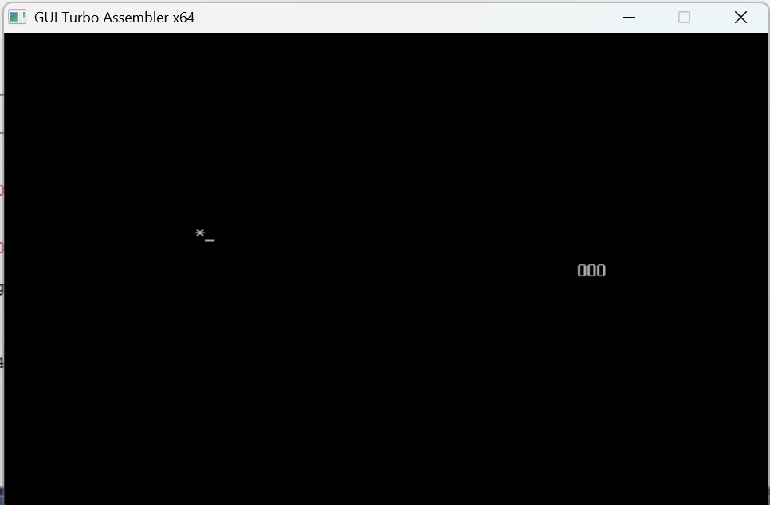

# 🐍 Snake Game in 8086 Assembly

A classic Snake game written in 16-bit x86 Assembly (MASM/TASM syntax), runs on DOSBox.

## Controls
| Key | Action |
|-----|--------|
| W | Move Up |
| A | Move Left |
| S | Move Down |
| D | Move Right |

## Features
- Snake wraps around screen edges
- Grows by 1 on eating food
- Dies only on self-collision
- Score tracking

## How to Run

### Using TASM (GUI Turbo Assembler)
1. Open the `.asm` file in GUI Turbo Assembler
2. Press **F9** to compile and run

### Using DOSBox + MASM
```bash
mount c c:\snake-game-8086
c:
masm snake.asm
link snake.obj
snake.exe
```

## Requirements
- DOSBox 0.74 or later
- MASM 6.11 or TASM (GUI Turbo Assembler)

## Screenshot


## Author
Sajjad — B.Tech Computer Engineering